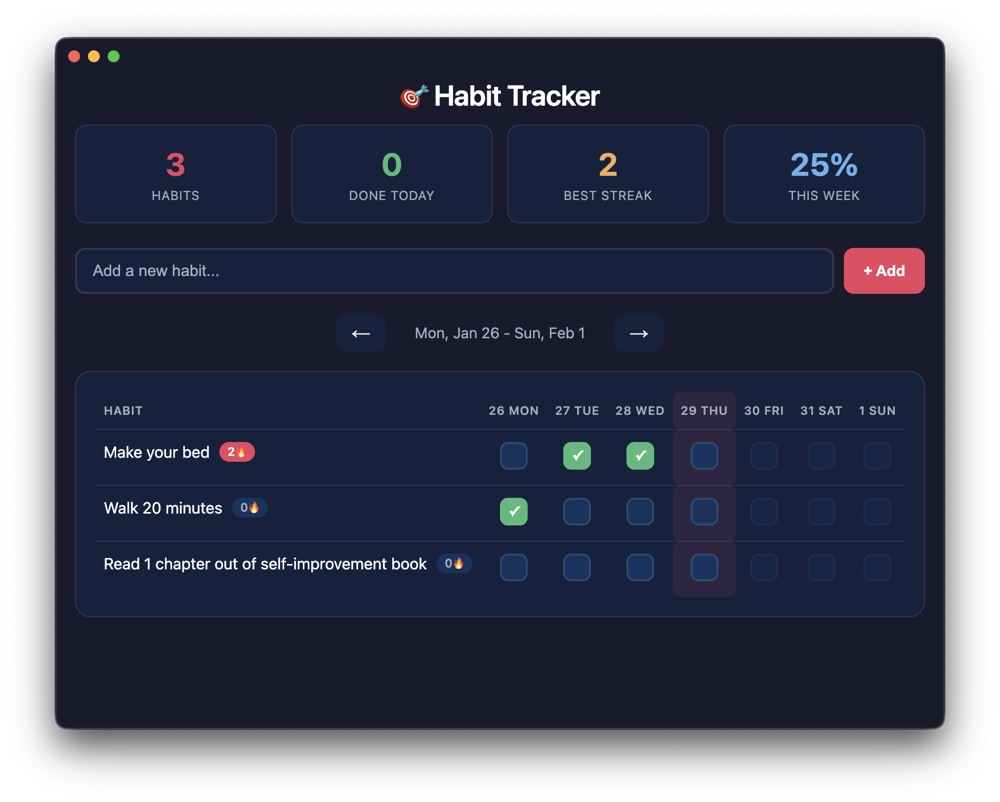

# 🎯 Habit Tracker

A sleek, modern desktop habit tracker built with Electron. Track your daily habits, maintain streaks, and visualize your progress.


## Screenshot



## Features

- ✅ **Add/Edit/Delete habits** — Simple habit management with modal UI
- 📅 **Daily tracking** — Check off habits for each day of the week
- 🔥 **Streak tracking** — See your current streak for each habit
- 📊 **Stats dashboard** — View total habits, daily completions, best streak, and weekly completion rate
- 📆 **Week navigation** — Browse past and current weeks
- 💾 **Persistent storage** — Data saved locally via electron-store
- 🌙 **Dark theme** — Easy on the eyes

## Installation

```bash
# Clone the repository
git clone https://github.com/WilCantrell/HabitTracker.git
cd HabitTracker

# Install dependencies
npm install

# Run the app
npm start
```

## Usage

1. **Add a habit** — Type in the input field and press Enter or click "+ Add"
2. **Track daily** — Click checkboxes to mark habits complete for each day
3. **Edit/Delete** — Click on a habit name to open the edit modal
4. **Navigate weeks** — Use arrow buttons to view different weeks

## Tech Stack

- **Electron** — Cross-platform desktop framework
- **electron-store** — Simple data persistence
- **Vanilla JS/CSS** — No framework bloat, just clean code

## Data Storage

Your data is stored locally at:
- **macOS**: `~/Library/Application Support/habit-tracker/`
- **Windows**: `%APPDATA%/habit-tracker/`
- **Linux**: `~/.config/habit-tracker/`

## License

MIT © Wil Cantrell
